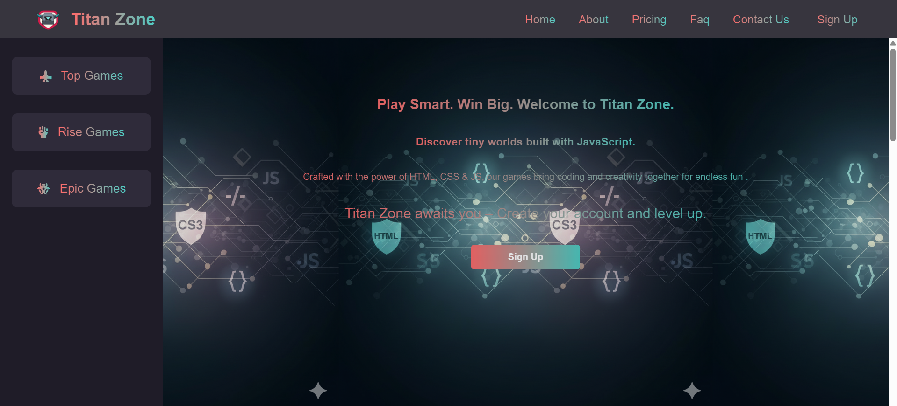
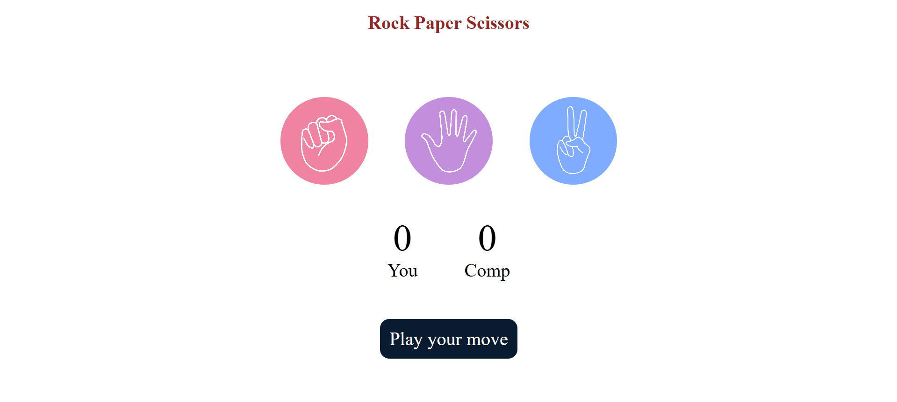
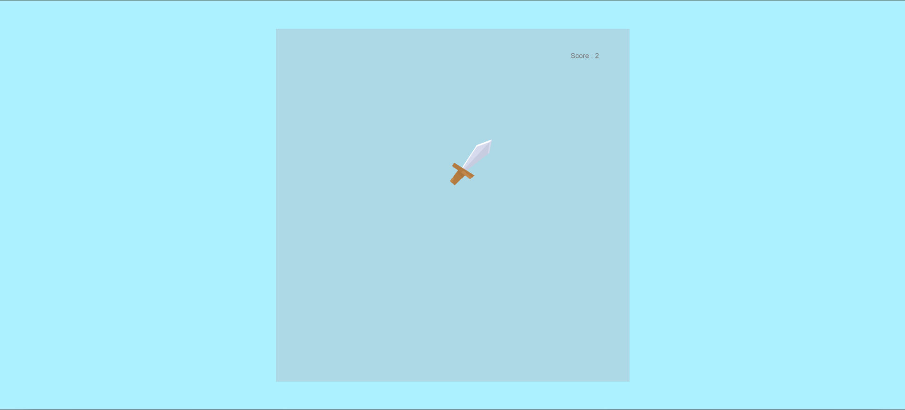
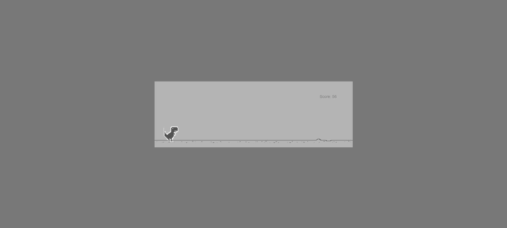
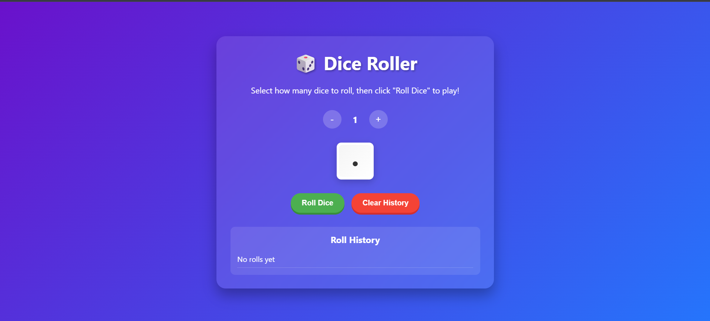

# Titan Games 🕹️

Welcome to **Titan Games** – a simple, fun, and engaging gaming hub where you can play small games directly in your browser. From classics to casuals, this platform brings all your favorite mini-games together in one place.  

---

Click Here to visit our website [Play Now](https://titanzone.netlify.app/)

---

## Key Features
- Multiple Games: Includes Snake, Tic Tac Toe, Dino Run, Dice roller , and more.  
- Instant Play: No downloads required, just open and start playing.  
- Responsive Design: Works smoothly on both desktop and mobile.  
- Clean Layout: Simple UI for distraction-free gameplay.  
- Expandable: More games and features will be added regularly.  

---

## Games List
Here are some of the games you’ll find on Titan Games:  

1. Snake Game – Eat food and grow longer without hitting yourself.  
2. Tic Tac Toe – A simple 3x3 strategy game for two players.  
3. Simon Game – Select the card in correct order to test your memory.  
4. Trex clone game – Jump over obstacles and keep running.  
5. 2048 – Score High as you can.  
6. Traffic Game – Obey the rules of traffic.  
7. Math Puzzle – Solve interesting math question.  
8. Dice Roller – Roll yout dice to check how lucky you are !  
9. Rock Paper Scissors – Play against the computer.  
10. Number Guessing Game – Guess the secret number.  
11. Emoji Catcher – Click Fast to score.  
12. Hardest 2D game – Cross the obsracles to win the game.  
13. Fruit Ninja – Cut the fruits like a ninja to score
14. Typing Game – Be fast in typing
15. Football Game – You and your friend can play this game.
15. Scrambled Game – Arrange the letters to create the word.

---

## Screenshots

### Home Page

### Sample Game

## Project Structure
- `index.html` – Main landing page  
- `javascript/` – Folder containing individual game files  
- `img/` – Images used in games and UI  
- `css/` – Stylesheet for layout and design   
- `icons/` – Contain all icons 
- `pages/` – Contain all game pages and basic pages as follow
- `about.html` – About the website  
- `contact.html` – Contact details page  
- `prizing.html` – Buy our premium subscription 
- `login.html` – LogIn and play 
- `faq.html` – Frequently Asked Questions (FAQ)
- `contact.html` – Contact us 

---

## Contributors

---
